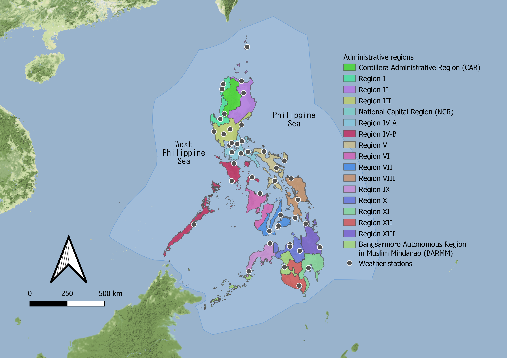
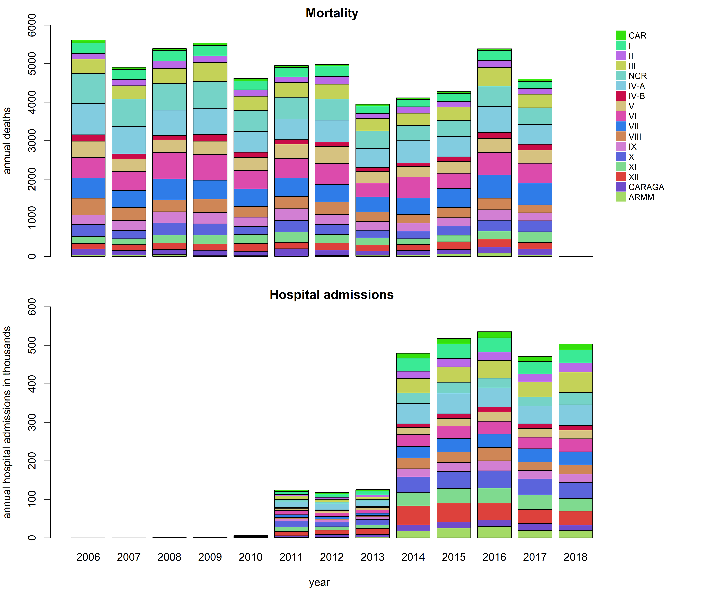
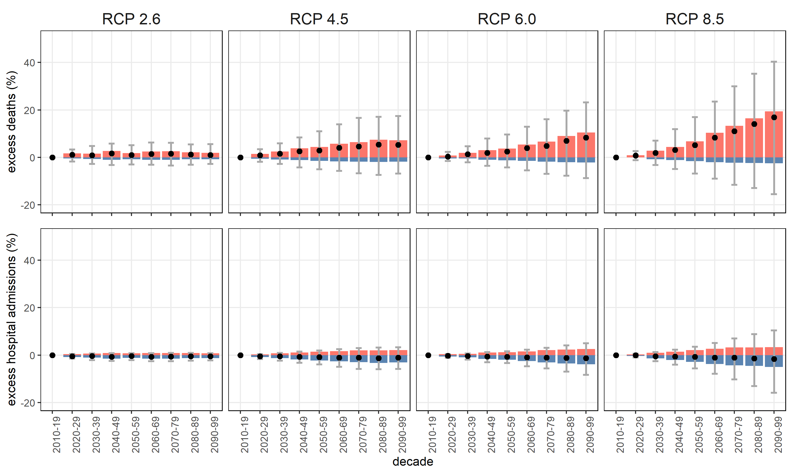
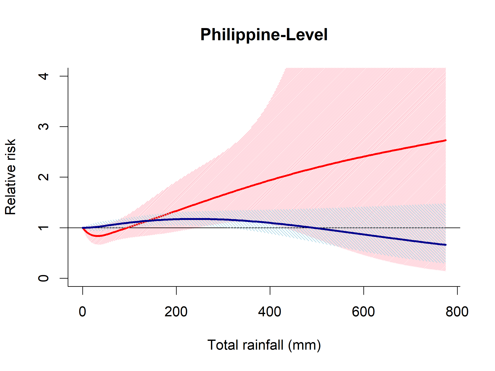

<style type="text/css">
  body{
  font-size: 14pt;
}
</style>

```{r setup, include=FALSE}
library(knitr)
opts_chunk$set(echo = FALSE)
```

## Background

In the Philippines, diarrheal diseases remain a public health concern. In 2016, the Philippine Department of Health (DOH) reported that diarrhea (i.e. acute watery and bloody diarrhea) remains to be one of the top 10 leading causes of morbidity with 174,418 reported cases (190.35 cases per 100,000 population) (DOH, 2018). In the same year, the Philippine Health Insurance Corporation (PhilHealth) recorded 381,492 acute gastroenteritis cases (367.63 cases per 100,000 population), amounting to PhP 2.2 billion (USD 40.6 million), from accredited hospitals across the country (PhilHealth, 2016). Due to changes in the natural and human processes, weather and climate could negatively impact transmission of diarrheal diseases (Smith et al., 2014). Some Philippine studies had already been done in associating diarrheal diseases with weather and climate; however, the methodologies applied were simple (Chua et al., 2019). In this research project, we investigated the spatiotemporal impact of weather and climate to diarrheal diseases. This was funded by the Department of Science and Technology - Philippine Council for Health Research and Development (DOST-PCHRD) that ran from October 2020 to March 2021.  

## Objectives

We modelled the short-term relationships between weather variability/extreme events and diarrhea by administrative regions. We also projected the excess diarrhea under different climate change and population change scenarios.

## Methods

### Data sources

We included 17 administrative regions in the Philippines (Figure 1). We obtained data on individual deaths and hospital admissions in 2006--2018 from the Philippine Statistics Authority (PSA) and the Philippine Health Insurance Corporation (PhilHealth) (Figure 2). They were coded with ICD 10 A00-A09 which are intestinal infectious diseases. We used the day of death and day of admission as the time index and used the regional address of death location and hospitals to aggregate into daily time series. We limited the time series from 01 January 2014 to 31 December 2017 because the number of hospital admissions was low in 2006--2013 and death records in 2018 were not available yet.   

   

   

We collected daily mean temperatures, mean relative humidity, and total rainfall from 44 weather stations of the Philippine Atmospheric, Geophysical and Astronomical Services Administration (PAGASA) (Figure 1). We imputed the daily missing meteorological values using multiple linear regressions. We also collected 2-meter temperatures, relative humidity, and total precipitation from ERA5-Land dataset at 9km grids (Muñoz-Sabater 2019). We collected flooding and storm occurrences from [Emergency Events Database (EED)](https://www.emdat.be/). We aggregated each exposure by regional mean or counts. We derived the heat index from temperature and relative humidity using National Oceanic and Atmospheric Administration (NOAA) calculator.

For projections, we only used projected daily near surface air temperatures up to 2100 obtained from the Inter-Sectoral Impact Model Intercomparison Project 2b (ISIMIP2b). They correspond to downscaled 0.5° × 0.5° grids and bias-corrected CMIP5 simulations from four general circulation models (GCMs) namely GFDL-ESM2M, HadGEM2-ES, IPSL-CM5A-LR, and MIROC5. We considered Representative Concentration Pathways (RCPs) 2.6, 4.5, 6.0, and 8.5.

We collected socio-demographic indicators including regional population density in 2015 and gross regional domestic product in 2017 from the PSA (PSA, 2020), and regional percentages of households with access to improved safe water and with sanitary toilets in 2017 from the Field Health Services Information System of the Department of Health (DOH, 2019).

### Statistical analysis

We quantified regional exposure-mortality and exposure-hospital admission associations by modelling the daily non-linear lagged associations using quasi-Poisson generalized linear models with distributed lag nonlinear models (Gasparrini, 2014). Temperature, heat index, and rainfall were modelled using natural cubic B-spline (ns) with two degrees of freedom (df) and lag was modelled using ns with an intercept and three internal knots placed at log scale at 0-21 days. Flooding and storm were modelled linearly and followed the same modelling of lag but extended the maximum lag to 27 days. Time was modelled using ns with 4 df multiplied by 4 years to control for seasonality and long-term trends. We added day of the week and national holidays as covariates.

We combined the region-specific estimates using multivariate meta-regression models (Gasparrini et al., 2012). We initially ran an intercept-only model and then added meta-predictors: population densities, water and sanitation household coverages, and checked their significance using a Wald test. Residual heterogeneity was measured using I squared statistics and Cochran Q test. We then derived the best linear unbiased prediction (BLUP) of the overall cumulative associations by region in relative risks (RR). We determined minimum risk values (MRV) for temperature and heat index using the lowest cumulative RRs between the 2.5th and 97.5th percentiles of region-specific exposure distribution. We re-centred the cumulative associations using the MRVs as reference. Rainfall associations were centered at 0 mm. We derived the overall country-level associations from the intercept-only models.

We estimated the excess diarrhea mortality and hospital admissions attributable to non-optimal temperatures in 2010 to 2099 using the regional cumulative temperature--diarrhea associations with assumptions of population changes and no adaptation. The components attributable to high and low temperatures were separated by summing subsets of days with temperatures above and below the MRVs (Gasparrini et al. 2017). The ratio of the attributable numbers to the total enteric infection outcome was the total attributable fraction. We calculated separately the excess outcomes for each region and SSP, as well as combinations of GCMs and RCPs. Attributable numbers and fractions were calculated as GCM-ensemble by region, and then aggregated as Philippine-level, decade, and RCP using the total number of outcomes as denominator. Monte Carlo simulations were used to derive empirical confidence intervals (eCIs) (Gasparrini et al. 2017).

### Ethical consideration

The study protocol underwent ethical review and was approved by the National Ethics Committee of the Philippine Council for Health Research and Development (study number 2020-001) on 20 April 2020. We received de-identified individual deaths and hospital admissions data, and only the research team had access to the datasets.

## Results

### Descriptive statistics

A total of 18,387 deaths and 2,004,268 hospital admissions were reported in 2014-2017. Most of the deaths and hospital admissions were from the National Capital Region (NCR) and Region 4A, respectively. Mean daily regional deaths were few at less than 1, while daily mean regional hospital admissions were 81 (Table 1). Temperature and heat index distributions were narrow and generally similar across regions except Cordillera Administrative Region (CAR), which had lower values. Rainfall distributions were skewed to the right and mostly occurred in July-August. There were 13 major flood occurrences in 2014-2017 with majority occurring in the southern regions. A total of 35 major typhoons were reported most of which affected the northern regions.   

```{r echo=FALSE, results='asis', message=FALSE, warning=FALSE}
library(tidyverse)
library(kableExtra)
tab1 <- read.csv("tab1_summary.csv")
kbl(tab1,caption='<b>Table 1. Summary variables expressed in regional distribution</b>')  %>%
  kable_classic(full_width = F) %>%
  kable_styling(bootstrap_options = c("striped", "hover"),font_size = 18) %>%
  footnote(general="Min - minimum; P25 - 25th percentile; P75 - 75th percentile; RH - relative humidity; TP - total precipitation",
           symbol="weather stations")
```

### Temperature and heat index

Using weather stations, cumulative associations between daily mean temperatures and diarrhea mortality were U-shaped in the Philippine-level (Figure 3). Flatter cumulative associations were observed for hospital admissions. Diarrhea mortality was estimated to increase by 0.03% (95%CI: -0.01%; 0.08%) increase while hospital admissions increase by 0.01% (95%CI: -0.05%; 0.10%) per 1°C rise in daily temperature. The highest associations were observed in NCR. Using daily heat index attenuated the associations for mortality. Similar associations were found using ERA5-Land data but had narrower confidence intervals. Temperature-related excess deaths were expected to increase under scenarios with high climate forcing, while excess hospital admissions were estimated to reduce by end of the century (Figure 4).   

   



### Rainfall

Cumulative rainfall-diarrhea associations in Philippine-level were nonlinear and varied in shapes (Figure 5). Rainfall-mortality associations showed an initial decrease in risks but increased under extreme rainfall. For hospital admissions, the risks increased up to 240 mm and declined thereafter. The results using ERA5-Land differed with the weather stations data.

{width=75%}

### Floods and typhoons

We only found associations for both floods and typhoons for mortality due to diarrhea (Figure 6). Flood occurrence was significantly associated to mortality after 21 days. For typhoons, significant lag days were between 5 to 25 days. No significant associations were found for hospital admissions.

```{r, echo=FALSE,out.width="49%",out.height="20%",fig.cap="**Figure 6. Cumulative associations for floods and typhoons with, 2014-2017.** Red is mortality, blue is hospital admissions, and solid lines are relative risks",fig.show='hold'}
include_graphics(c("fig6_flood.png","fig6_storm.png"))
``` 


## Summary

Our findings suggest that daily diarrhea was associated with daily temperatures, rainfall, floods, and typhoons. Mortality due to diarrhea had higher heat-related risks than hospital admissions. This led to the projected increase in mortality, while hospital admissions may reduce by the end of the 21st century. The nonlinear effects of rainfall differed for mortality and hospital admissions showing mortality risks occur under extreme rainfall. Floods and typhoons increased the risk of mortality but not for hospital admissions.

## Sample data and R codes

Sample data and R codes for National Capital Region can be accessed [here](https://github.com/paulcarlos/final_report_diamod). 

## Research team

Miguel Antonio Salazar, MD, MScIH, ScD (Principal investigator)\
Paul LC Chua, MSc (Co-investigator)\
Braylien Siy, MD, MPH (Research staff)\
Masahiro Hashizume, MD, PhD (collaborator)\
Chris Fook Sheng Ng, PhD (collaborator)\
Veronika Huber, PhD (collaborator)

## References
Chua PL, Dorotan MM, Sigua JA, Estanislao RD, Hashizume M, Salazar MA. Scoping Review of Climate Change and Health Research in the Philippines: A Complementary Tool in Research Agenda-Setting. International Journal of Environmental Research and Public Health. 2019 Jan;16(14):2624. doi:10.3390/ijerph16142624.   

DOH (Philippine Department of Health). Field health service information system: 2016 annual report. 2018. https://www.doh.gov.ph/sites/default/files/publications/FHSIS2016.pdf. [accessed 22 April 2018].   

Gasparrini A, Armstrong B, Kenward MG. Multivariate meta‐analysis for non‐linear and other multi‐parameter associations. Statistics in Medicine. 2012 Dec 20;31(29):3821-39. doi:10.1002/sim.5471.

Gasparrini A, Leone M. Attributable risk from distributed lag models. BMC Medical Research Methodology. 2014 Dec;14(1):1-8. doi:10.1186/1471-2288-14-55.   

Gasparrini A, Guo Y, Sera F, Vicedo-Cabrera AM, Huber V, Tong S, Coelho MD, Saldiva PH, Lavigne E, Correa PM, Ortega NV. Projections of temperature-related excess mortality under climate change scenarios. The Lancet Planetary Health. 2017 Dec 1;1(9):e360-7. doi:10.1016/S2542-5196(17)30156-0.   

Muñoz-Sabater J. 2019. ERA5-Land hourly data from 1981 to present. Copernicus Clim Chang Serv Clim Data Store; doi:10.24381/cds.68d2bb30.     

PhilHealth (Philippine Health Insurance Corporation). 2016 Stats & Charts.
https://www.philhealth.gov.ph/about_us/statsncharts/snc2016.pdf [accessed October 17, 2018].   

Smith, K.R., A.Woodward, D. Campbell-Lendrum, D.D. Chadee, Y. Honda, Q. Liu, J.M. Olwoch, B. Revich, and R. Sauerborn, 2014: Human health: impacts, adaptation, and co-benefits. In: Climate Change 2014: Impacts, Adaptation, and Vulnerability. Part A: Global and Sectoral Aspects. Contribution of Working Group II to the Fifth Assessment Report of the Intergovernmental Panel on Climate Change [Field, C.B., V.R. Barros, D.J. Dokken, K.J. Mach, M.D. Mastrandrea, T.E. Bilir, M. Chatterjee, K.L. Ebi, Y.O. Estrada, R.C. Genova, B. Girma, E.S. Kissel,A.N. Levy, S. MacCracken, P.R. Mastrandrea, and L.L.White (eds.)]. Cambridge University Press, Cambridge, United Kingdom and New York, NY, USA, pp. 709-754.

